# Musing: Automated Election Data Pipeline

**Date:** 2026-06-04
**Status:** Draft — thinking aloud about what an autonomous pipeline could look like

## The Vision

Give the pipeline a list of locations (municipalities, counties) and city clerk website URLs. From there, it:

1. Discovers upcoming elections, their dates, and types
2. Resolves the full jurisdictional hierarchy (state → county → municipality → precinct)
3. Populates offices, races, candidates, and ballot questions
4. Monitors for news updates, new polls, endorsements, and candidate developments
5. Surfaces confidence-coded diffs for human review

Could this run autonomously, with a human in the loop only for editorial judgment and fact-checking? Let's think it through.

## What the Current Data Model Already Covers

Our existing registries in `_data/` map well to a pipeline's output targets:

| Registry | Current Coverage | Pipeline-Ready? |
|----------|-----------------|-----------------|
| `election.js` | Single hardcoded election event | Partial — needs date/type discovery |
| `geography.js` | Hand-curated hierarchy (6 nodes) | Partial — needs automated expansion |
| `jurisdictions.js` | 5 jurisdictions with district mappings | Partial — needs auto-resolution |
| `offices.js` | 23 offices with inheritance (`extends`) | Good — pattern supports reuse across elections |
| `parties.js` | 4 parties | Complete for Maine |
| `issues.js` | 93 issue labels | Good — extensible vocabulary |
| `candidates.js` | ~50 candidates with FK refs | Partial — needs automated candidate discovery |
| `races.js` | Rich race data with positions, sources | Partial — core structure solid, content needs pipeline |
| `ballotQuestions.js` | 3 budget referendums | Partial — needs auto-discovery |
| `sources.js` | ~80 sources with full attribution | Good — `sourceId` referencing pattern works |
| `pollingLocations.js` | Empty stub | Not started |
| `precincts.js` | Empty stub | Not started |

## What the Data Model Needs

### 1. Election Discovery Manifest

The current `election.js` is a single hardcoded object. A pipeline needs:

```js
// _data/electionManifest.js - NEW
module.exports = {
  locations: [
    {
      geographyId: "south-portland",
      clerkUrl: "https://www.southportland.org/departments/city-clerk/",
      state: "maine",
      county: "cumberland-county",
      stateElectionsUrl: "https://www.maine.gov/sos/cec/elec/",
      ballotpediaPrefix: "https://ballotpedia.org/Maine"
    },
    // ... more locations
  ],
  polling: {
    intervalHours: 6,
    sources: [
      "maine-sos",
      "city-clerk",
      "ballotpedia",
      "news-rss"
    ]
  }
};
```

### 2. Scraped Source Provenance

Sources currently have `accessed: null`. A pipeline needs to track *when* and *how* data was obtained, plus confidence:

```js
// Extension to Source schema
{
  id: "source-001-campaign-platform",
  url: "https://www.grahamforsenate.com/platform",
  label: "Campaign platform",
  summary: "...",
  type: "source",
  // NEW FIELDS:
  provenance: {
    discoveredBy: "pipeline-scrape-2026-05-01",
    ingestionMethod: "web-scrape",       // or "rss", "api", "manual"
    lastValidated: "2026-05-28T14:00:00Z",
    validationStatus: "confirmed",       // confirmed | unchanged | changed | broken
    confidenceScore: 0.95                // 0-1, based on source reliability + freshness
  }
}
```

### 3. Poll Tracking

Nothing in the current model tracks polls. We need:

```js
// _data/polls.js - NEW
module.exports = [
  {
    id: "poll-unh-2026-05-senate",
    race: "us-senate-democratic",
    pollster: "UNH Survey Center",
    dateConducted: "2026-05-20",
    datePublished: "2026-05-27",
    sampleSize: 850,
    marginOfError: 3.4,
    results: [
      { candidate: "graham-platner", percentage: 52 },
      { candidate: "david-costello", percentage: 23 },
      { candidate: "undecided", percentage: 25 }
    ],
    sourceId: "source-007-unh-survey-center",
    isPartisanPrimary: true,
    grade: "A-",                         // FiveThirtyEight-style pollster rating
    methodology: "Live phone"             // methodology tag
  }
];
```

### 4. Endorsement Registry

Endorsements exist in the narrative data model but aren't tracked as structured data yet:

```js
// _data/endorsements.js - NEW
module.exports = [
  {
    id: "endorsement-sanders-platner",
    candidate: "graham-platner",
    race: "us-senate-democratic",
    endorser: "Bernie Sanders",
    endorserType: "political-figure",     // political-figure | newspaper | union | nonprofit | organization
    date: "2026-04-15",
    sourceId: "source-NNN-sanders-endorsement",
    quote: "a great working class candidate for Senate in Maine"
  }
];
```

### 5. Change Events / Audit Trail

A pipeline that runs autonomously needs an audit trail of what changed and when:

```js
// _data/changeLog.js - NEW
module.exports = [
  {
    id: "changelog-2026-05-28-001",
    timestamp: "2026-05-28T06:15:00Z",
    trigger: "scheduled-poll",
    changes: [
      {
        registry: "candidates",
        action: "add",
        entityId: "new-candidate-id",
        data: { name: "New Candidate", party: "democrat" },
        confidence: 0.7
      },
      {
        registry: "sources",
        action: "update",
        entityId: "source-006-portland-press-herald",
        field: "validationStatus",
        oldValue: "confirmed",
        newValue: "changed",
        confidence: 1.0
      }
    ],
    reviewedBy: null,                      // null until human reviews
    reviewedAt: null
  }
];
```

### 6. Candidate News Events

The current race data has `secondaryContent` with ad-hoc headings like "Controversies" and "Background". A pipeline should produce structured events:

```js
// _data/candidateEvents.js - NEW
module.exports = [
  {
    id: "event-platner-texts-2026-05-30",
    candidate: "graham-platner",
    race: "us-senate-democratic",
    eventType: "controversy",             // announcement | withdrawal | endorsement | controversy | debate | poll | legal | policy-shift
    date: "2026-05-30",
    title: "Sexual texts revealed",
    summary: "Wife Amy Gertner told campaign staff she found sexually explicit texts...",
    impact: "high",                        // low | medium | high
    sourceIds: ["source-NNN-cnn", "source-NNN-nyt"],
    incorporated: true,                    // has this been folded into race content?
    incorporatedIn: "us-senate-democratic.secondaryContent[1]"
  }
];
```

## Pipeline Architecture

### Phase 1: Discovery — From Location to Election Calendar

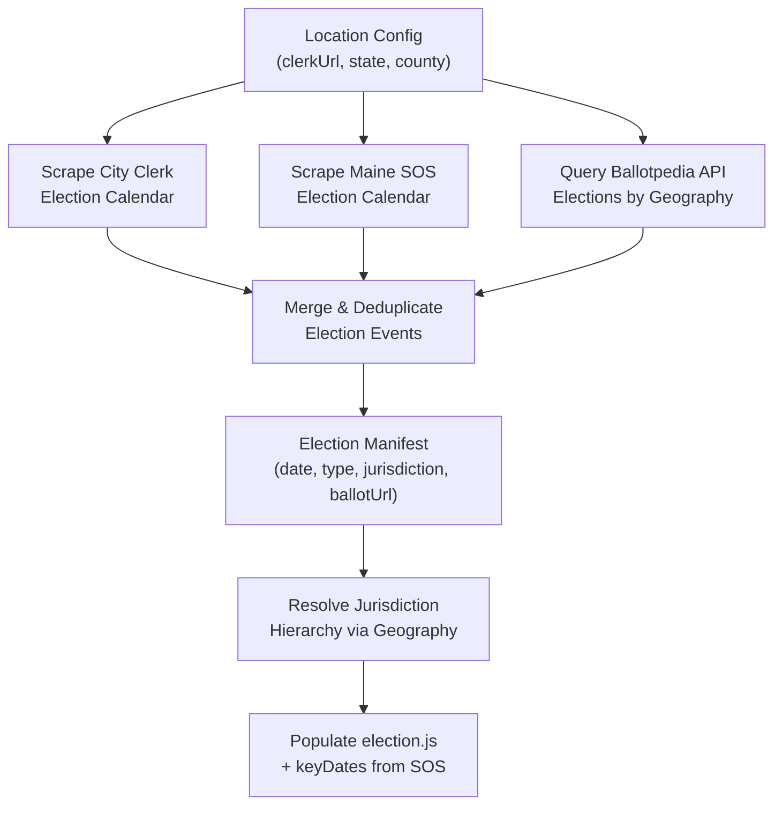

The pipeline starts with a location configuration. From a city clerk URL and state elections page, it discovers election dates, types (primary, general, special), and ballot structure. Ballotpedia serves as a cross-reference for completeness.

### Phase 2: Race & Candidate Resolution

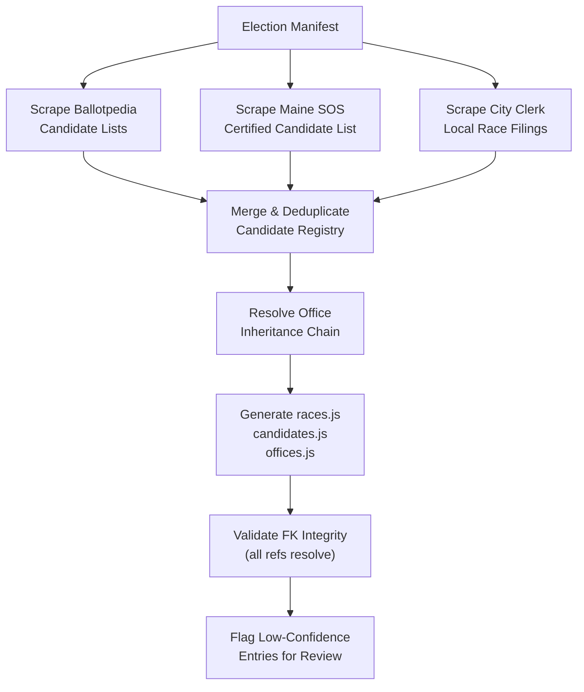

Ballotpedia provides the master candidate list. Maine SOS provides the official certified list after filing deadlines. Local clerk sites provide municipal-specific races. Merging requires deduplication (a candidate may appear on multiple source lists with slight name variations).

### Phase 3: Content Harvesting — Positions, News, Events

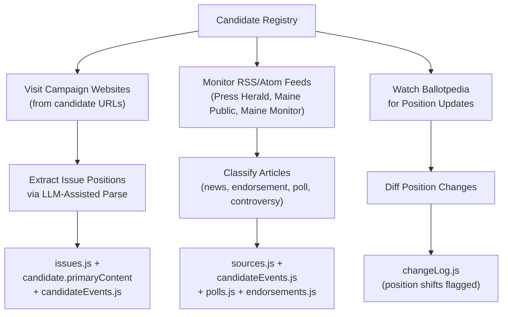

Campaign websites are scraped for issue positions using LLM-assisted extraction. News feeds are monitored for articles about candidates and races. The pipeline classifies each incoming article and routes it to the appropriate registry.

### Phase 3.5: LLM Pipeline Stages

The pipeline has several stages where an LLM is not a helper but the core processing engine. Each LLM stage is a discrete step with defined inputs, outputs, prompts, and failure modes. Treating them as first-class pipeline stages (not "and then the LLM does the magic") makes the system auditable, debuggable, and safe.

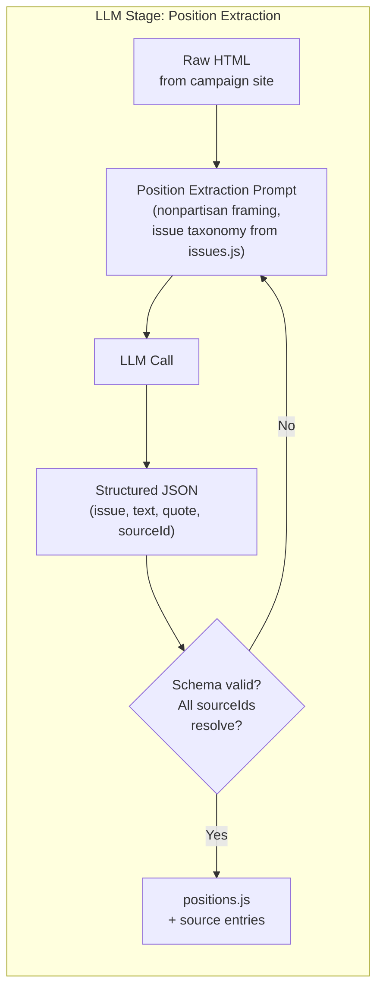

#### LLM Stage 1: Position Extraction

**Input:** Raw HTML from a candidate's campaign website (issues page, about page, platform page)
**Output:** Array of `{issue, text, quote?, sourceId}` objects matching our `issues.js` taxonomy

The prompt must:
- Map extracted positions to existing `issues.js` labels, or propose new labels if no match
- Attribute every position to a specific page section
- Flag when a position is inferred vs. directly stated
- Produce neutral, factual summaries (not campaign language)
- Return structured JSON that validates against the `primaryContent` schema in `races.js`

**Failure modes:**
- Candidate site returns obfuscated JavaScript-rendered content → fall back to `media-summary` skill for transcript extraction
- LLM hallucinates positions not on the page → validate by searching the raw HTML for quoted text
- Position doesn't match any `issues.js` label → flag for human taxonomy review, don't silently invent labels
- Candidate has no issues page → classify as `"limited-public-platform"` or `"no-public-platform"` (we already have these in `issues.js`)

**Model weight:** Medium (Sonnet-class). This is structured extraction with a constrained vocabulary, not open-ended generation.

#### LLM Stage 2: Article Classification & Routing

**Input:** Article text from an RSS feed or scrape (title, byline, body)
**Output:** Classification label + structured extraction

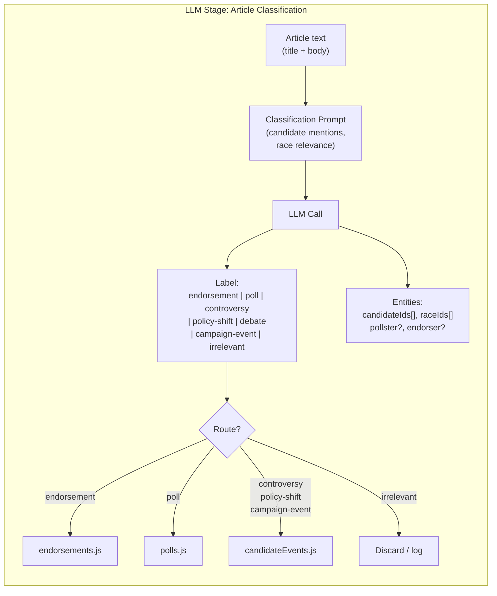

**The prompt must:**
- Identify which candidate(s) and race(s) the article relates to (using `candidates.js` and `races.js` as reference)
- Classify into a closed set of event types matching our `candidateEvents.js` schema
- Extract structured data: pollster name + numbers, endorser name + quote, controversy summary
- Flag opinion vs. reporting (we attribute opinions to named sources, never state them as fact)
- Return a confidence score (0-1) for the classification

**Failure modes:**
- Article mentions a candidate in passing (not about the race) → classify as `irrelevant`, don't inflate relevance
- LLM classifies satire or opinion as straight news → confidence gate catches these; human reviews anything below 0.7
- Ambiguous race assignment → route to multiple races and flag for dedup
- New candidate not in `candidates.js` → create preliminary entry with `confidence: 0.5`, flag for verification

**Model weight:** Medium (Sonnet-class). Classification with a known label set. Could also use a fine-tuned smaller model for cost efficiency at scale.

#### LLM Stage 3: Nonpartisan Framing Rewrite

**Input:** Raw position extraction output (from Stage 1) or candidate event summary
**Output:** Rewritten content in our house style — neutral, attributed, non-endorsement framing

This is our editorial LLM pass. It takes raw extraction output and rewrites it to meet the project's content guidelines (see `.agents/agents-md-detail/content-guidelines.md`). The prompt must:

- Strip campaign language ("fighting for you", "the only choice") and replace with neutral attribution ("Platner has stated...", "according to the campaign website")
- Attribute opinions to named sources
- Balance coverage across candidates in a race (flag if one candidate has far more extracted positions than another)
- Use terms from `UBIQUITOUS-LANGUAGE.md`
- Never endorse or evaluate candidates

**Failure modes:**
- LLM introduces subtle bias (hedging one candidate's positions more than another) → human review always required here, even at high confidence
- LLM preserves campaign framing by paraphrasing rather than rewriting → prompt engineering issue, detectable by running a second LLM pass that checks for campaign-language residue
- Content becomes bland or loses specificity → keep direct quotes alongside summaries

**Model weight:** Heavy (Opus-class). This is the most editorially sensitive step. Needs the best model available. Human review is mandatory, not optional.

#### LLM Stage 4: Controversy Impact Assessment

**Input:** A news article or series of articles about a candidate controversy
**Output:** Structured `candidateEvent` with `impact` rating (low/medium/high) and a neutral summary

**The prompt must:**
- Assess whether the controversy affects the core of the candidate's platform vs. being a peripheral issue
- Determine news staying power: single-day story vs. ongoing investigation
- Rate impact relative to the race context, not in absolute terms
- Never make predictions about electoral consequences
- Provide source links and attribution for every claim

**Failure modes:**
- LLM rates sensational but irrelevant stories as high-impact → require 2+ independent sources before rating `high`
- LLM under-rates genuinely impactful stories → cross-reference with how other races/candidates are covered
- LLM adopts partisan framing from the source article → the nonpartisan rewrite pass (Stage 3) catches this

**Model weight:** Heavy. Impact assessment requires understanding political context. This is judgment, not extraction.

#### LLM Stage 5: Diff & Drift Detection

**Input:** Previous version of a candidate's positions (from `races.js`) + newly extracted positions
**Output:** Structured diff highlighting additions, removals, and shifts

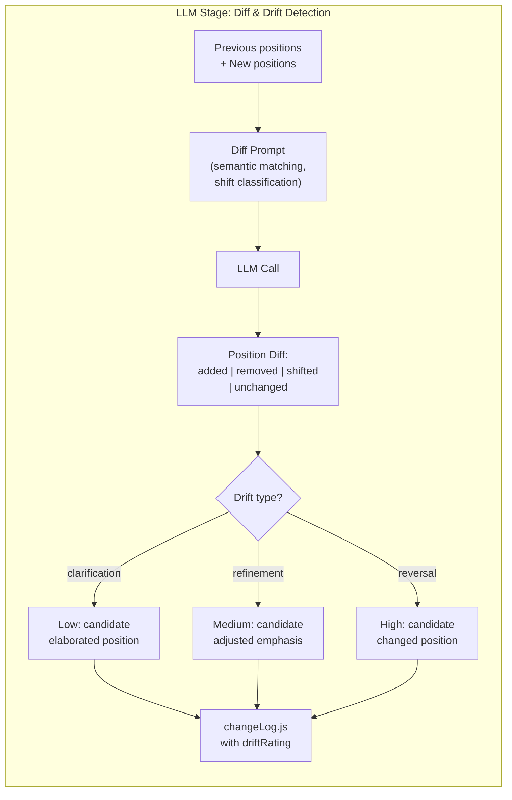

**The prompt must:**
- Match current positions to previous positions semantically (not just by `issues.js` label, since labels can change)
- Classify each shift as: `clarification` (more detail, same stance), `refinement` (adjusted emphasis), or `reversal` (changed stance)
- Flag reversals as high-priority for editorial review
- Handle new issues (candidate added a platform section) and dropped issues (candidate removed a section)

**Failure modes:**
- LLM sees minor wording changes as position shifts → requires semantic understanding beyond text diffing
- LLM misses genuine reversals because the candidate's language stayed similar → prompt should focus on policy implications, not rhetoric
- Position pages reorganized but content unchanged → detect as `unchanged` with `clarification` on presentation

**Model weight:** Medium-High. Semantic comparison of political positions requires understanding subtlety. Sonnet-class works for clear shifts; Opus-class needed for nuanced drift detection.

#### LLM Stage Orchestration

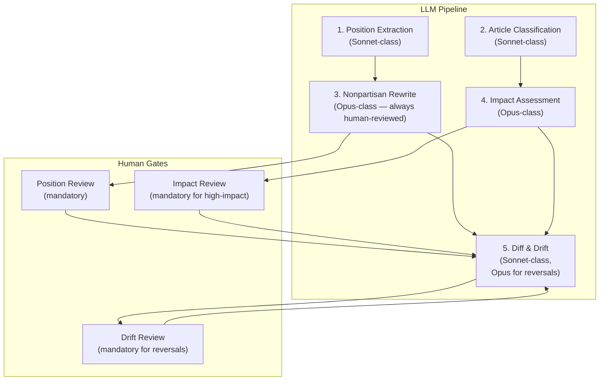

#### LLM Cost & Latency Estimates

| Stage | Model | Avg Tokens/Call | Est. Cost/Call | Calls/Cycle | Est. Cost/Cycle |
|-------|-------|-----------------|---------------|-------------|-----------------|
| Position Extraction | Sonnet | ~3,000 in / ~1,500 out | $0.02 | ~50 candidates | ~$1.00 |
| Article Classification | Sonnet | ~2,000 in / ~500 out | $0.01 | ~100 articles/6hrs | ~$1.00/day |
| Nonpartisan Rewrite | Opus | ~4,000 in / ~2,000 out | $0.12 | ~50 positions | ~$6.00 |
| Impact Assessment | Opus | ~5,000 in / ~1,000 out | $0.09 | ~10 controversies | ~$0.90 |
| Diff & Drift | Sonnet (Opus for reversals) | ~4,000 in / ~1,000 out | $0.02 | ~50 positions | ~$1.00 |

**Rough weekly cost during campaign season:** $20-40, with spikes around debates and breaking news.

#### Verification Gates

Every LLM stage is sandwiched between a pre-gate and a post-gate. Some gates are deterministic (schema checks), some use LLMs themselves (a lightweight model verifying a heavyweight model's output). This is not paranoia — it is how you build a pipeline that produces voter guide content you can trust.

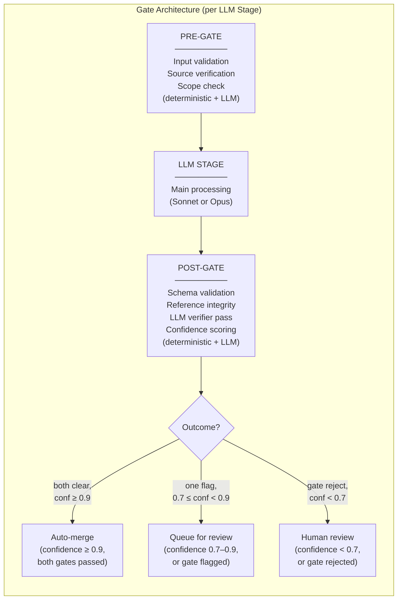

##### Pre-Gates (Before LLM Processing)

Every LLM call runs through these checks *before* the model sees the input:

| Pre-Gate | Type | What It Checks | Failure Action |
|----------|------|-----------------|----------------|
| **Input schema validation** | Deterministic | Input JSON conforms to the stage's expected schema (e.g., position extraction requires `url`, `rawHtml`, `candidateId`) | Reject — malformed input goes to error log, not LLM |
| **Source liveness** | Deterministic (HTTP HEAD) | The source URL returns 200, is not a redirect to a different domain, has not changed since last fetch (via ETag/Last-Modified) | Skip — stale or dead sources shouldn't be reprocessed. Flag for source validation pipeline |
| **Scope gate** | LLM (Haiku-class) | "Does this input actually contain content relevant to [stage purpose]?" For position extraction: "Does this page contain substantive policy positions?" For article classification: "Is this article about a candidate or race in our coverage area?" Routes irrelevant content out before wasting an Opus call. | Discard — irrelevant input skipped. Low cost (Haiku call is ~$0.001). |
| **Candidate/entity resolution** | Deterministic | Any explicitly referenced `candidateId`, `raceId`, `issueId` in the input resolves in the current registries. Unresolvable IDs are mapped to a `pending-review` bucket, not passed to the LLM. | Flag — input goes to entity resolution queue. New candidates get a provisional entry with `confidence: 0.3`. |
| **Reprocessing check** | Deterministic | Has this exact input (URL + content hash) been processed by this stage before? If so, skip unless forced. | Skip — avoids burning LLM tokens on unchanged content. |

The **scope gate** is the key pre-gate. Running a cheap Haiku call (~$0.001) to reject irrelevant input before an Opus call (~$0.10) saves real money and prevents the pipeline from hallucinating positions from a candidate's fundraising page or classifying a recipe newsletter as campaign news.

##### Post-Gates (After LLM Processing)

Every LLM output runs through these checks *before* it touches the data files:

| Post-Gate | Type | What It Checks | Failure Action |
|-----------|------|-----------------|----------------|
| **Output schema validation** | Deterministic | LLM output parses as valid JSON matching the target registry schema. Required fields present, types correct, no extra keys (unless allowed by schema) | Retry with tighter prompt (max 2 retries). After 2 failures, send to human review queue with the LLM output and the error. |
| **Reference integrity** | Deterministic | Every `candidateId`, `raceId`, `issueId`, `sourceId` in the output resolves to an existing entity in the registries | Rewrite — attempt to fuzzy-match unresolved IDs to existing entities. If no match, flag for human entity resolution. Never invent registry entries from LLM output alone. |
| **Nonpartisan compliance** | LLM (Haiku-class) | "Does this text contain endorsement language, framing that favors one candidate, or unattributed opinions?" The verifier receives the output and our content guidelines as a rubric. This is a lightweight check — it catches the most egregious bias, not nuance. | Flag — if the verifier catches bias, mark the output `biased: true` and downgrade confidence by 0.2. Does not block the pipeline, but forces human review. |
| **Attribution completeness** | LLM (Haiku-class) | "For every factual claim in this output, is there a source attribution?" Checks that positions, quotes, and statistics all trace back to a `sourceId`. | Flag — unattributed claims get `sourceNeeded: true`. Cannot auto-merge until resolved. |
| **Hallucination spot-check** | LLM (Sonnet-class) | Random sample (10% of outputs) — "Is every factual claim in this output supported by the source material provided as input?" Given both the raw input and the LLM output, the verifier checks for fabrication. | Block — if hallucination detected, downgrade confidence to 0.0 and send to human review. Escalate to 100% verification if hallucination rate exceeds 5% in a batch. |
| **Confidence scoring** | Deterministic + LLM | The main LLM's self-reported confidence + the post-gate verification results are combined. Deterministic checks contribute binary (pass/fail). LLM verifiers contribute a 0-1 score. The final confidence is: `min(main_llm_confidence, verifier_confidence) - penalties`. Penalties: -0.1 per failed deterministic check, -0.2 for bias flag, -0.3 for attribution gaps. | Below 0.7: mandatory human review. 0.7–0.9: auto-merge with `reviewed: false`. ≥ 0.9: auto-merge queued for spot-check. |

##### LLM-as-Verifier Economics

Using LLMs to verify other LLMs sounds expensive, but the cost math works out:

| Verifier Gate | Model | Tokens/Call | Cost/Call | Volume | Daily Cost |
|---------------|-------|-------------|-----------|--------|------------|
| Scope pre-gate | Haiku | ~500 in / ~50 out | $0.0002 | ~100 articles | ~$0.02 |
| Nonpartisan post-gate | Haiku | ~800 in / ~200 out | $0.001 | ~50 positions | ~$0.05 |
| Attribution post-gate | Haiku | ~600 in / ~100 out | $0.0005 | ~50 positions | ~$0.03 |
| Hallucination spot-check | Sonnet | ~3,000 in / ~500 out | $0.01 | ~5 sample (10%) | ~$0.05 |

**Total verifier cost: ~$0.15/day.** That's about 1% of the main LLM pipeline cost. A Haiku call that prevents one Opus hallucination ($0.12) on irrelevant input pays for itself immediately.

##### Escalation Protocol

When a post-gate verifier fails, the pipeline doesn't silently retry. It escalates:

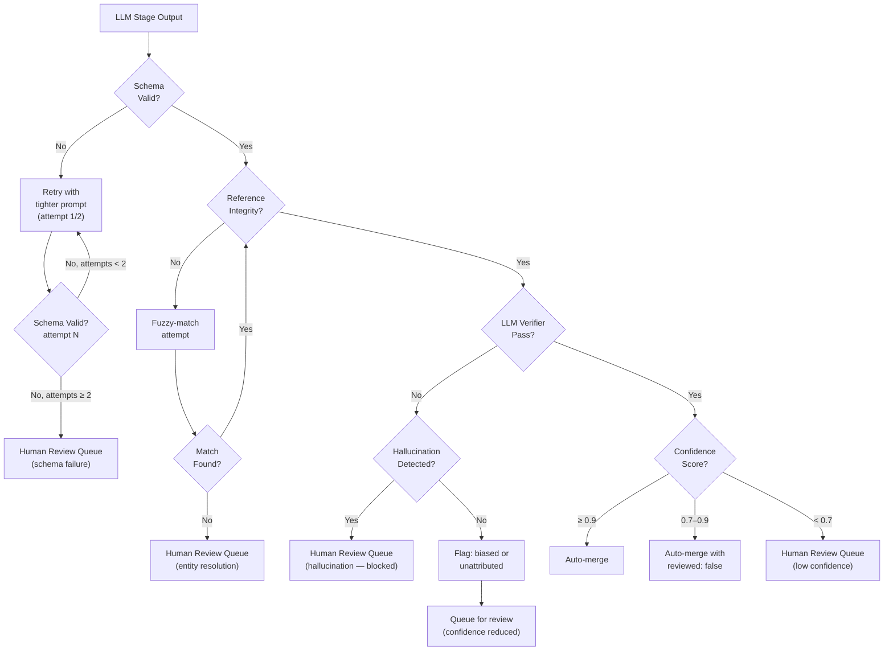

Key principle: **the pipeline never silently drops data, and never silently merges unverified data.** Every output has a fate: auto-merge, queued-for-review, or blocked-for-human. Nothing falls through the cracks.

The human review queue is not optional. It is the system's most important feature.

### Phase 4: Continuous Monitoring Loop

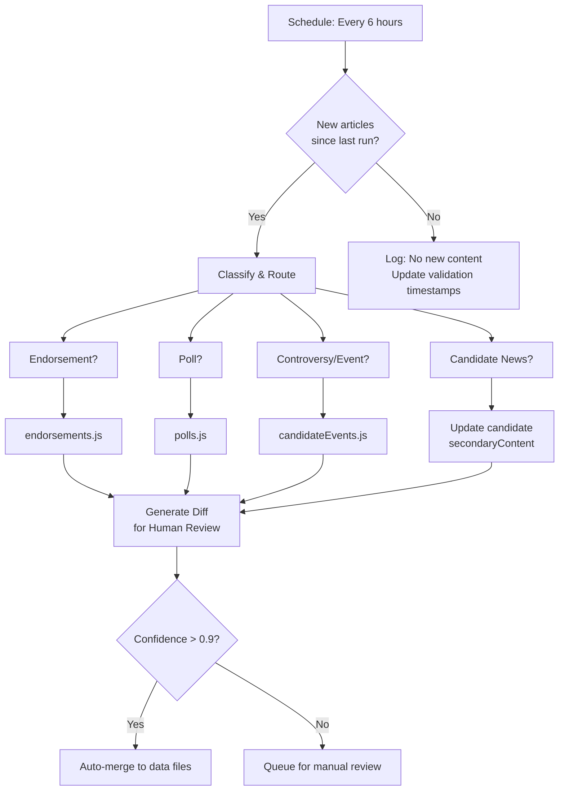

The monitoring loop runs on a schedule. High-confidence updates (routine news mentions, unchanged source validation) can auto-merge. Low-confidence updates (new candidate claims, controversial events) queue for human review via `changeLog.js`.

### Phase 5: Full Pipeline Orchestration

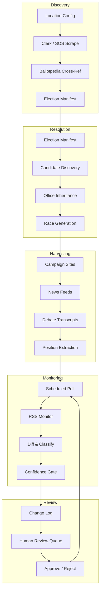

## Autonomous Operation Considerations

### What Can Be Fully Automated

| Task | Automation Level | LLM Stage | Notes |
|------|-----------------|------------|-------|
| Election date discovery | **High** | None (scraping) | City clerk and SOS calendars follow predictable patterns. Ballotpedia API provides structured data. |
| Jurisdiction hierarchy resolution | **High** | None (GIS lookup) | State → county → municipality is a fixed hierarchy. Precincts rarely change. |
| Candidate list compilation | **Medium-High** | None (merge/dedup) | After filing deadlines, certified candidate lists are authoritative. Before deadlines, Ballotpedia is best-effort. |
| Position extraction from campaign sites | **Medium** | **Stage 1: Position Extraction** (Sonnet) | LLM extracts positions into structured JSON. Human review required for accuracy and nonpartisan framing. |
| Article classification & routing | **Medium-High** | **Stage 2: Article Classification** (Sonnet) | LLM classifies news articles into endorsement/poll/controversy/etc. Confidence gate catches misclassifications. |
| Nonpartisan framing rewrite | **Low** | **Stage 3: Nonpartisan Rewrite** (Opus) | Most editorially sensitive LLM step. Human review mandatory. Pipeline provides drafts; humans finalize. |
| Controversy impact assessment | **Medium** | **Stage 4: Impact Assessment** (Opus) | LLM proposes impact ratings. Human reviews high-impact calls. Requires political context understanding. |
| Position drift detection | **Medium** | **Stage 5: Diff & Drift** (Sonnet/Opus) | Semantic comparison of position changes. Reversals always flagged for human review. Clarifications can auto-merge. |
| Poll tracking | **High** | None (structured data) | Structured data (pollster, dates, numbers). Easy to validate against source. |
| Source validation (link checking) | **High** | None (HTTP HEAD) | Already partially automated in pre-commit hooks. |
| Ballot question discovery | **Medium** | **Stage 1 variant** (extraction) | Legal text extraction from clerk sites works, but plain-language explanations require LLM rewriting + human review. |
| Endorsement tracking | **Medium-High** | **Stage 2** (classification) + extraction | LLM classifies articles mentioning endorsements, extracts endorser/quote/candidate. Confidence gate for ambiguous cases. |

### What Needs Human Review

1. **Candidate position summaries** — The pipeline extracts positions; humans rewrite for nonpartisan framing and attribution
2. **Impact assessments** — A "high-impact" controversy tag requires editorial judgment
3. **Ballot question plain-language** — Legal text → voter-friendly language requires a writer
4. **Endorsement significance** — Which endorsements matter is editorial
5. **Any confidence < 0.7** — Auto-queue anything the pipeline isn't sure about

### Confidence Scoring

The pipeline assigns confidence scores (0-1) based on:

- **Source reliability**: Official SOS (0.95), Ballotpedia (0.85), major newspaper (0.8), campaign site (0.7), social media (0.4)
- **Cross-validation**: Data confirmed by 2+ sources gets a boost (+0.1)
- **Freshness**: Data older than 7 days gets a decay factor
- **Structural match**: Does the data fit the expected schema? Missing fields reduce confidence

### Scheduling

```
┌─────────────────────────────────────────────────────┐
│  Pipeline Schedule                                   │
├─────────────────────────────────────────────────────┤
│  Discovery:     Monthly (or on filing deadline dates) │
│  Resolution:    Weekly after filing deadlines close    │
│  Harvesting:    Daily during active campaign season    │
│  Monitoring:    Every 6 hours during campaign season   │
│  Validation:   Every 24 hours (source URL checks)     │
│  Review queue:  Push notifications for confidence < 0.7│
└─────────────────────────────────────────────────────┘
```

### Data Sources by Phase

| Source | Phase | Type | Notes |
|--------|-------|------|-------|
| Maine SOS elections page | Discovery | Scrape | Official election calendar |
| City clerk websites | Discovery | Scrape | Municipal election info |
| Ballotpedia API | Discovery + Resolution | API | Structured candidate/race data |
| Maine SOS certified candidate list | Resolution | PDF/Scrape | Authoritative after filing deadline |
| Campaign websites | Harvesting | Scrape + LLM | Issue positions |
| Press Herald RSS | Monitoring | RSS/Atom | News articles |
| Maine Public RSS | Monitoring | RSS/Atom | News + debate transcripts |
| The Maine Monitor RSS | Monitoring | RSS/Atom | Investigation reporting |
| Ballotpedia positions page | Harvesting | API | Position updates |
| FiveThirtyEight / 538 pollster ratings | Monitoring | API | Poll metadata |
| Google Civic Information API | Discovery | API | Polling locations (if available for ME) |

## Open Questions

1. **Ballotpedia rate limits** — How much can we hit their API before getting throttled? Do we need a paid tier?
2. **Maine SOS structure** — Their website is notoriously not-machine-readable. Scraping will be fragile. Is there a better official source?
3. **Campaign website changes** — Candidates redesign their sites. How do we diff positions across time? Should we archive snapshots?
4. **Non-English content** — Some Maine communities have multilingual outreach. Should the pipeline handle translation?
5. **Polling locations** — These come from city clerks but change per election. The Google Civic API may not cover all Maine municipalities.
6. **Ethical guardrails** — An autonomous pipeline that scrapes candidate websites and classifies news could produce biased output. What editorial review gates are mandatory before anything hits the live site?
7. **Temporal tracking** — Candidates change positions. Should we version positions over time and show evolution?

## Implementation Path

If we were to build this, the rough order would be:

1. **Election manifest + location config** — Define the schema, populate manually for June 2026
2. **Source provenance** — Add `provenance` fields to `sources.js`
3. **Poll tracking** — Create `polls.js` registry
4. **Endorsement registry** — Create `endorsements.js`
5. **Candidate events** — Create `candidateEvents.js`
6. **Change log** — Create `changeLog.js` with confidence scoring
7. **Discovery scraper** — City clerk + SOS calendar scraping
8. **Resolution pipeline** — Candidate/race generation from Ballotpedia + SOS
9. **Harvesting pipeline** — Campaign website extraction + LLM position parsing
10. **Monitor loop** — RSS monitoring + classification + diff generation

Steps 1-6 are data model extensions. Steps 7-10 are the actual automation. Start with data model, prove it works manually, then automate the manual steps.