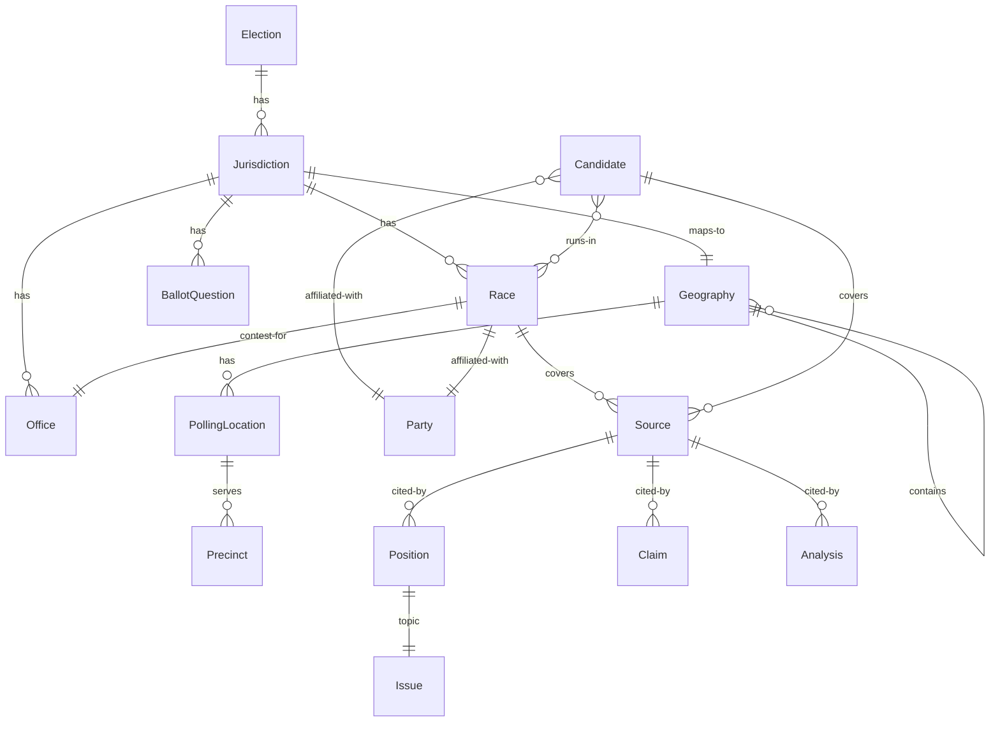
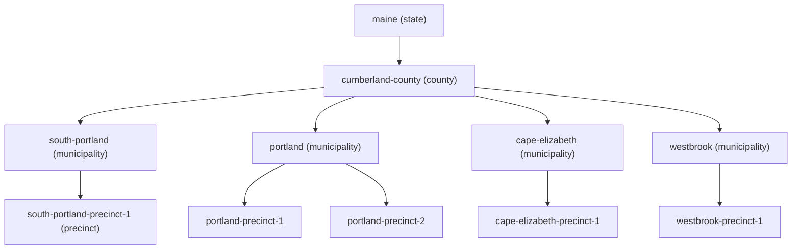

# Plan: DDD Refactor — Election Data Model

## Problem Statement

The current data model has several structural issues that will compound as content grows:

1. **Race duplication** — Statewide races (US Senate, Governor) are duplicated across all 4 municipal jurisdictions in `_data/races.js` (7,427 lines total). Modifying a statewide race requires editing the same content in 4 places.

2. **Flat jurisdiction model** — Jurisdictions are a flat array with no hierarchy. There's no county-level jurisdiction (e.g., Cumberland County commissioner races), and no inheritance mechanism (state → county → city).

3. **Missing aggregates** — `PollingLocation`, `Precinct`, and `Election` are defined in the canonical data model but have zero implementation.

4. **Unused canonical data** — `_data/election-2026-06.yml` holds structured candidate registration data but is not consumed by any template.

5. **`stateSenateDistrict` vs `stateSenateDistricts`** — Inconsistent field naming across jurisdiction objects.

## Proposed Model

Canonical ID principle: every aggregate has a unique `id` slug. This enables cross-references across all data files: sources reference which races/candidates they cover, candidates reference which races they're in, positions reference which source they cite.

### Geography vs Jurisdiction — two distinct concepts

**Geography** is a physical location hierarchy: `Planet → Country → State → County → City → Neighborhood → Street Address`. It describes where a voter lives.

**Jurisdiction** is the governing entity that runs an election and whose races appear on your ballot. A voter's geography determines which jurisdictions they fall under. One voter may vote in races for multiple jurisdictions at once.

Example — a voter in South Portland:

```
Geography:  Earth → USA → Maine → Cumberland County → South Portland → Precinct 1
Jurisdictions the voter falls under:
  ├── State of Maine         → Governor, US Senate, CD-1, state legislature, state ballot questions
  ├── Cumberland County      → County commissioner races
  └── City of South Portland → School budget referendum, city council races
```

A voter in Cape Elizabeth has the same state and county jurisdictions but a different municipal one. The geography branch diverges at the city node but the state and county jurisdictions remain shared.

**What this means for the model:**

| Concept | Stores | Example |
|---------|--------|---------|
| **Geography** | Places, hierarchy, precinct boundaries | `Maine → Cumberland → South Portland` |
| **Jurisdiction** | Entities that run elections | `state-wide`, `cumberland-county`, `south-portland` |

A jurisdiction has a `geoScope` that maps it to a geography level:
- `state-wide` → geoScope: `state`, geoRef: `maine`
- `cumberland-county` → geoScope: `county`, geoRef: `cumberland`
- `south-portland` → geoScope: `municipality`, geoRef: `south-portland`

A voter's address resolves to their geography, which resolves to their jurisdictions, which determines their ballot.

Jurisdictions inherit via geography: if your municipality is South Portland, you also fall under Cumberland County and Maine jurisdictions. This replaces the flat `parent` field with a principled hierarchy.

### Entity-Relationship Diagram



Key insight: **Race and Office are different aggregates.**

- **Office** — The position itself. Governor, US Senate, State House District 120. Has term length, duties description, jurisdiction. Persists across election cycles. Exists independently of any election.
- **Race** — This election's contest for that office. Governor Republican Primary 2026. Has candidates, context, voting rules. References an office + election + party. Links to a jurisdiction for scoping.

The current model conflates them — `race.title = "Governor — Republican Primary"` embeds the office name, `officeDesc` is duplicated in every race entry. Separating them means changing an office description updates every race for that office automatically.

### Bounded Context: Research

Research lives upstream of the site build — it feeds content but doesn't need to render. Sources, however, must be cited inline for transparency.

| Aggregate | Description | Lives in |
|-----------|-------------|----------|
| **Source** | An original URL (news article, campaign page, debate transcript, PDF) | `_data/sources.js` — centralized registry |
| **SourceClaim** | A specific fact attributed to a source | Embedded on each Position/statement |

**Current pain:** Every position in `_data/races.js` embeds `sourceUrl` + `sourceLabel` as inline strings. This works but:
- Same URL repeated across multiple positions (no dedup)
- No unique ID to cross-reference with `research-keeper` (rk) library
- No way to verify every claim has a source (or find claims missing one)
- No way to ask "which races reference this source?"

**Proposed:** A `_data/sources.js` registry:

```js
// _data/sources.js — centralized, deduplicated
module.exports = [
  {
    id: "maine-morning-star-gop-debate-may-5",
    url: "https://mainemorningstar.com/2026/05/05/...",
    label: "Maine Morning Star — GOP debate, May 5",
    races: ["governor-republican", "cd1-republican"],  // all races this source covers
    candidates: ["bobby-charles", "garrett-mason"],     // optional: specific candidates mentioned
    rkId: "rk:abc123",                                  // optional: link to research-keeper library
    accessed: "2026-05-06",
    type: "news-article"
  }
]
```

Positions reference by ID:

```js
// Inside a candidate's primaryContent
{
  "issue": "State Budget",
  "text": "Proposed cutting $4 billion...",
  "sourceIds": ["maine-morning-star-gop-debate-may-5"]
}
```

Templates resolve `sourceId` → source object to render the link. This gives us:
- Single source of truth for URLs
- Validation: every claim must have a valid `sourceId`
- Cross-reference with rk for research audit trails
- Easier to generate a "Sources" section per page
- Ability to display "sources covering this race" on race pages

**Relationship to research-keeper (rk):** The `rk` CLI at `~/code/research-keeper/` manages the research process (ingesting, tagging, synthesizing). The `_data/sources.js` registry is the *output* of that process — the subset of rk sources that are cited in the voter guide. They don't need to be synced automatically; the content author promotes sources from rk to `_data/sources.js` when writing content.

### Aggregate: Election

Single root per election event. Wraps everything.

| Field | Type | Source |
|-------|------|--------|
| `id` | slug | `_data/election-2026-06.js` |
| `title` | string | `election-2026-06.yml` → promoted to `.js` |
| `date` | date | `election-2026-06.yml` |
| `type` | enum | `election-2026-06.yml` |
| `keyDates` | KeyDate[] | `election-2026-06.yml` |

### Aggregate: Geography (hierarchical)

The physical place hierarchy. Independent of elections — a geography exists whether or not there's an election.

| Field | Type | Notes |
|-------|------|-------|
| `id` | slug | e.g., `cumberland-county`, `south-portland`, `precinct-1` |
| `name` | string | Display name |
| `type` | enum | `state` \| `county` \| `municipality` \| `precinct` |
| `parent` | slug | Parent geography id (state has none) |
| `aliases` | string[] | Alternate names (e.g., `["Cumberland County", "Cumberland Cty"]`) |

Example hierarchy:



### Aggregate: Jurisdiction (hierarchical, maps to Geography)

Who runs the election. Each jurisdiction has a `geoRef` linking it to one Geography node.

| Field | Type | Notes |
|-------|------|-------|
| `id` | slug | Unique (e.g., `south-portland`) |
| `name` | string | e.g., "South Portland" |
| `geoRef` | slug | Links to Geography.id (e.g., `south-portland`) |
| `geoScope` | enum | `state` \| `county` \| `municipal` — which geo level this jurisdiction covers |
| `county` | string | County name (for display) |
| `stateSenateDistricts` | number[] | Plural, always array (fix inconsistency) |
| `stateHouseDistricts` | number[] | Always array |

A jurisdiction's inheritance is determined by walking the Geography hierarchy from its `geoRef` up to the root. `getEffectiveJurisdictions(municipality)` walks up the geography tree and returns all jurisdictions whose `geoRef` matches a geography node on that path.

Example — South Portland voter's jurisdictions:
```
geo path:        maine ← cumberland-county ← south-portland
jurisdictions:   [state-wide, cumberland-county, south-portland]
                  ↑ geoRef=maine,       ↑ geoRef=cumberland,   ↑ geoRef=south-portland
                     geoScope=state        geoScope=county        geoScope=municipal
```

### Aggregate: Office

The position itself — persists across elections, not tied to any one cycle.

| Field | Type | Notes |
|-------|------|-------|
| `id` | slug | e.g., `governor`, `state-house-120` |
| `title` | string | e.g., "Governor" |
| `jurisdiction` | slug | Type of jurisdiction this office serves |
| `termLength` | string | e.g., "4 years" |
| `termLimit` | string | e.g., "2 consecutive terms" |
| `seatsAvailable` | integer | e.g., 1 |
| `officeDesc` | string | What this office does (HTML) |
| `type` | enum | `partisan` \| `nonpartisan` |

### Aggregate: Party

Canonical small registry.

| Field | Type | Example |
|-------|------|---------|
| `id` | slug | `democrat`, `republican`, `green`, `libertarian` |
| `tag` | string | `d`, `r`, `g`, `l` |
| `fullName` | string | "Democratic Party" |
| `shortName` | string | "Democrat" |
| `color` | string | Hex color for UI |

### Aggregate: Issue

Controlled vocabulary for position labeling. Enables cross-race comparison.

| Field | Type | Example |
|-------|------|---------|
| `id` | slug | `taxes`, `healthcare`, `housing`, `education` |
| `label` | string | "Taxes" |
| `description` | string | Optional — what this issue area covers |

### Aggregate: Race (normalized, stored once)

No more duplication. Each race stored once, keyed by slug.

| Field | Type | Notes |
|-------|------|-------|
| `id` | slug | Unique (e.g., `governor-republican`) |
| `title` | string | e.g., "Governor — Republican Primary" |
| `jurisdiction` | slug | Scoping jurisdiction (`state-wide` for statewide races) |
| `election` | slug | Links to Election (`2026-06-primary`) |
| `office` | slug | Links to Office (`governor`) |
| `party` | slug | Which party's primary this is (`republican`) |
| `context` | string | Race-specific context (HTML) |
| `voting` | string | How to vote in this race (HTML) |
| `candidates` | slug[] | Ordered list of candidates running |
| `positionGroups` | PositionGroup[] | Per-candidate positions + background |

`PositionGroup` is derived from today's `candidates[]` inside a party block — candidate data, positions, sources — but the candidate's base info (name, party, website) lives in the Candidate registry.

### Aggregate: Race Party Block

Each party in a race needs its own set of content:

| Field | Type | Notes |
|-------|------|-------|
| `race` | slug | Parent race |
| `party` | slug | `democrat` or `republican` |
| `candidates` | slug[] | Candidates on this party's ballot |
| `raceWideSecondary` | block[] | Polling, RCV dynamics, campaign finance |
| `compareTable` | CompareRow[] | Side-by-side comparison |
| `crossPartyPreview` | slug | Race slug for opposing party (resolved at render) |

### Aggregate: BallotQuestion

Already normalized (one per slug). Add `election` FK and jurisdiction inheritance.

| Field | Type | Notes |
|-------|------|-------|
| `id` | slug | Unique |
| `title` | string | |
| `jurisdiction` | slug | Question also inherits from parent |
| `office` | slug | Office reference (school budget = school board) |
| `election` | slug | Election FK |
| `questionText` | string | Exact ballot language |
| `voting` | string | How to vote on this question |
| `sources` | slug[] | Source IDs |

### Aggregate: Candidate (canonical registry)

Promote to proper data source. Race content references candidates by slug.

| Field | Type | Notes |
|-------|------|-------|
| `id` | slug | Unique (e.g., `bobby-charles`) |
| `name` | string | Full name |
| `party` | slug | Party ID |
| `races` | slug[] | All races this candidate is in |
| `incumbent` | boolean | |
| `occupation` | string | |
| `residence` | string | |
| `campaignWebsite` | URL | |
| `ballotpediaUrl` | URL | |
| `photo` | URL | |
| `sources` | slug[] | Sources covering this candidate |

Race-specific content (positions, background) stays embedded in the race's `positionGroups` — it's per-race. The candidate registry holds what's true across races: name, party, occupation, website.

### Aggregate: PollingLocation

New data file `_data/pollingLocations.js`. A physical address belongs to a Geography, not a Jurisdiction — the geography resolves to jurisdictions.

| Field | Type |
|-------|------|
| `id` | slug |
| `name` | string |
| `address` | string |
| `geoRef` | slug | Geography.id that contains this location |
| `accessible` | boolean |
| `hours` | string |
| `precincts` | string[] |

### Aggregate: Precinct

New data file `_data/precincts.js`. Precincts are the leaf level of Geography.

| Field | Type |
|-------|------|
| `id` | string |
| `pollingLocation` | slug |
| `geoRef` | slug | Geography.id |
| `wards` | string[] |

### Presentation Changes

| Concern | Current | Future |
|---------|---------|--------|
| Race page URL | `/{jurisdiction}/races/{slug}/` | Same — inferred from race's jurisdiction + slug |
| Jurisdiction page | Filters `races` by `r.jurisdiction == j.slug` | Filters by `getEffectiveRaces(j)` (includes inherited) |
| `_data/races.js` | 7,427 lines, duplicated | ~1,800 lines, normalized |
| Race content | All in one file | Could split per race or per category |
| `_data/jurisdictions.js` | Flat array | Hierarchical with `parent` field |

## Data Migration Plan

Every phase transforms `_data/` files from current structure to new structure. The detailed migration plan — including per-file field mappings, validation queries, and rollback procedures — lives in the spoke directory at [`./ddd-refactor-plan/`](./ddd-refactor-plan/).

### Quick Reference

| File | Contents |
|------|----------|
| [`phase-table.md`](./ddd-refactor-plan/phase-table.md) | Phase-by-phase input/output table, dependency graph |
| [`per-file-migration.md`](./ddd-refactor-plan/per-file-migration.md) | Detailed field mappings for every `_data/` file transformation |
| [`validation.md`](./ddd-refactor-plan/validation.md) | Post-migration integrity checks, FK referential integrity queries |
| [`rollback.md`](./ddd-refactor-plan/rollback.md) | Per-phase rollback commands, full revert procedure |

### Phase Table (summary)

| Phase | Input | Output / Rewritten | New Files Created |
|-------|-------|--------------------|-------------------|
| 1 | `races.js`, `jurisdictions.js`, `election-2026-06.yml` | `jurisdictions.js` (rewrite) | `geography.js`, `offices.js`, `parties.js`, `issues.js`, `pollingLocations.js`, `precincts.js`, `election.js` |
| 2 | `races.js` (current) | `races.js` (rewrite) | — |
| 3 | `election-2026-06.yml`, `races.js` | — | `candidates.js` |
| 4 | `races.js`, `ballotQuestions.js` | `races.js`, `ballotQuestions.js` (sourceIds) | `sources.js` |
| 5 | Hub files, spoke dirs | Hub files (rewrite) | 6 new spoke files |
| 6 | Built site | — | — |

### Rollback

Each phase is isolated by commit. See [`rollback.md`](./ddd-refactor-plan/rollback.md) for per-phase and full rollback procedures.

### Phase 1: Foundation (type registries + jurisdiction hierarchy)
1. Create `_data/offices.js` — canonical office registry from existing `office` + `officeDesc` values
2. Create `_data/parties.js` — party registry (`democrat`, `republican`, `green`, `libertarian`)
3. Create `_data/issues.js` — controlled vocabulary of issue labels extracted from existing positions
4. Normalize `_data/jurisdictions.js` — add `id`, `type`, `parent` fields, consistent `stateSenateDistricts`
5. Add `getAncestors()` and `getEffectiveRaces()` helpers
6. Add `_data/pollingLocations.js` — compile from SoS source
7. Add `_data/precincts.js` — compile from city sources
8. Promote `_data/election-2026-06.yml` to an Eleventy data file with proper schema
9. Update `.eleventy.js` with new collections, filters, and computed data

### Phase 2: Race normalization
1. Rewrite `_data/races.js` to use new model:
   - `id` → canonical slug
   - `office` → Office.id FK
   - `party` → Party.id FK (for partisan races)
   - `election` → Election.id FK
   - `candidates` → Candidate.id[] FK array
   - Cross-reference to sources via `sourceIds[]`
2. Deduplicate statewide races — store once with `jurisdiction: "state-wide"`
3. Split `_data/races.js` into separate files per race category (optional — one file or many)
4. Update `content/race-pages.njk` pagination to inherit races from parent jurisdictions
5. Update `content/pages/jurisdiction-home.md` to use `getEffectiveRaces()`
6. Add county-level jurisdiction `cumberland-county` with its races (county commissioner)
7. Update `crossPartyPreview` resolution to look up opposing party race by slug at render time
8. Update `race.njk` layout to resolve Office, Party, Issue, Election from registries

### Phase 3: Candidate registry
1. Create `_data/candidates.js` from `election-2026-06.yml` data
2. Reference candidates by `id` in race content
3. Combine with embedded position content (what's race-specific stays in race)
4. Single source of truth for name, party, residence, campaign website, photo

### Phase 4: Sources registry
1. Create `_data/sources.js` — deduplicated from all `sourceUrl`+`sourceLabel` pairs used across `_data/races.js` and `_data/ballotQuestions.js`
2. Assign each source a unique `id`, `races[]`, optional `candidates[]`
3. Update all position `sourceUrl` + `sourceLabel` → `sourceIds[]` references
4. Update `race.njk` and `ballot-question.njk` to resolve `sourceId → Source` for rendering
5. Add validation check: every claim must have a valid `sourceId` (fail the build if not)

### Phase 5: Scaffolding — hub files, spokes, and missing docs

The refactor touches every hub file and many spoke directories. This phase brings all documentation in sync with the implemented model and fills existing gaps.

| Hub File | Status | Work Required |
|----------|--------|---------------|
| `PURPOSE.md` | OK | No changes — purpose unchanged |
| `ARCHITECTURE.md` | **UPDATE** | DDD bounded context map, ERD, aggregate list, cross-context communication patterns |
| `UBIQUITOUS-LANGUAGE.md` | **UPDATE** | Add Geography (state/county/municipality/precinct), Office, Party, Issue, Source terms. Deprecate old conflated terms |
| `TECH-STACK.md` | REVIEW | May need Eleventy collection/filter additions |
| `DEVELOPER-WORKFLOWS.md` | **UPDATE** | Add validation steps (source integrity check, FK referential integrity check, cross-party preview resolution check) |
| `USER-EXPERIENCE.md` | REVIEW | URL structure unchanged but breadcrumb logic changes with jurisdiction inheritance |

Existing spoke gaps to fill (6 missing files):

| Spoke Directory | Missing Files | Reason |
|-----------------|---------------|--------|
| `docs/architecture/` | `context-map.md`, `c4.md` | C4 context/container diagrams and DDD context map — overdue |
| `docs/ubiquitous-language/` | `presentation.md` | UI/site presentation terms (page, layout, breadcrumb, component) |
| `docs/developer-workflows/` | `setup.md`, `content-pipeline.md`, `ci-cd.md` | Setup, content pipeline, and CI/CD documentation — the whole spoke is empty |

New spoke content created during this refactor:

| File | Content |
|------|---------|
| `docs/architecture/context-map.md` | DDD bounded context map: Research → Election Data → Voter Guide Content → Presentation, with relationships and data flow |
| `docs/architecture/c4.md` | C4 model: Context (user → Eleventy SSG → static site), Container (data files → templates → layouts → HTML), Component (race.njk, jurisdiction-home.md, etc.) |
| `docs/architecture/data-model.md` | **REWRITE** — replace old model with canonical aggregates: Geography, Jurisdiction, Office, Party, Issue, Election, Race, PartyBlock, BallotQuestion, Candidate, Source, PollingLocation, Precinct, PositionGroup, CompareRow, RaceWideSecondary, VoterResources |
| `docs/ubiquitous-language/presentation.md` | Site presentation terms: page types (jurisdiction-home, race, ballot-question, voter-resources), layout inheritance, breadcrumb pattern |
| `docs/developer-workflows/setup.md` | Node version, `npm install`, `.eleventy.js` config, data directory structure |
| `docs/developer-workflows/content-pipeline.md` | How to add a race, add a candidate, add a source, update positions. FK validation rules |
| `docs/developer-workflows/ci-cd.md` | GitHub Pages deploy, build validation, source integrity checks |

Also update `AGENTS.md` project-navigation spoke to reflect the new architecture.

### Phase 6: Polish + testing
1. Verify all existing URLs still resolve correctly
2. Verify breadcrumbs still work
3. Add polling location display to voter resources
4. Update `docs/architecture/data-model.md` to match implementation
5. Clean up deprecated fields and dead code

## Risk Assessment

| Risk | Mitigation |
|------|------------|
| Broken URLs in static site | Phase 1+2 preserve all existing URL paths; no redirects needed |
| Content regression from normalization | Phase-by-phase with verification after each |
| Polling/precinct data incomplete | Start with what's known from existing sources, mark as draft |
| Template logic complexity | Keep helper functions in `.eleventy.js` or dedicated `_data/*.js` files |